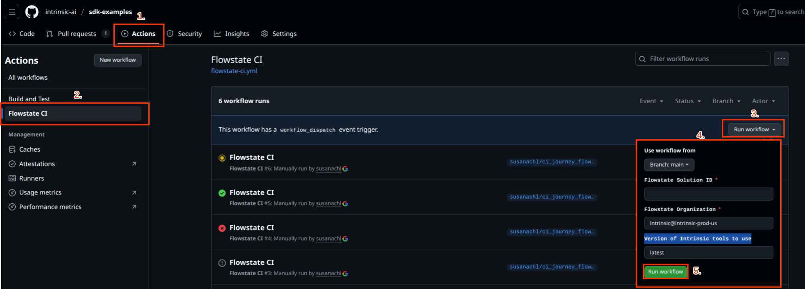

# CI/CD journey

This guide shows how to setup and run the `flowstate-ci.yml` Github action.

## Overview

This journey guides you into several `inctl` commands in order to go through an end to end test. 
To demonstrate an exemplary workflow setup, it will use content of the [sdk-examples](https://github.com/intrinsic-ai/sdk-examples). 
By default, the workflow is configured to build and test the following targets: 
   * *Skills:* `//skills/start_stopwatch:start_stopwatch_skill`,`//skills/stop_stopwatch:stop_stopwatch_py_skill` 
   * *Service:* `//services/stopwatch:stopwatch_service`.

These can be overridden using the workflow inputs.

## Setup

1. Add the `INTRINSIC_API_KEY` from `inctl auth login` as a secret on Github: 
   Before starting the task, you'll need to add your own `INTRINSIC_API_KEY` as a Github secret. 
   You can follow [this guide](https://docs.github.com/en/actions/how-tos/write-workflows/choose-what-workflows-do/use-secrets#creating-secrets-for-a-repository) in order to create the secret in a GitHub environment.
   This one expires in 90 days and you can use it during this time. 
   
> [!WARNING] 
> The key will be revoked if you create another API key with the same user by invoking `inctl auth login` again. 
   

2. The CI workflow will execute against a running solution on either a VM or an IPC. 
   If you don't already have an existing testing solution in your organization, create a new one following [this guide](https://flowstate.intrinsic.ai/docs/guides/build_with_flowstate/create_a_new_solution/). 
   To configure which solution to test with, you will need the respective solution ID. 
   To get your solution id, you can either retrieve it from the solution list in the portal (click the 3 dots next to your solution and select *Copy solution ID*).

3. The CI workflow will use tooling (e.g. inctl) that is provided through the Intrinsic SDK. 
   To specify which version of Intrinsic SDK tooling you want to use for the required tools, you have to provide a version tag for the SDK repository. 
   By default this can be set to *latest*, indicating the latest tagged release. 
   Alternatively, you can select a specific SDK version by entering its release tag name, e.g. "v1.23.20250825".

## Running the workflow

This CI pipeline is a modular workflow using reusable GitHub Actions. 
This design is reliable, easy to debug, and ensures proper resource cleanup.
This new set of actions goes through the following steps:

1. Check Intrinsic Organization.
2. Deploy an existing solution.
3. Build the skill(s).
4. Install the skill(s).
5. Build the service(s).
6. Install the service(s).
7. Add the service(s).
8. Add a process that uses the skill and service.

The main logic is broken into these actions:

1. **`build-targets`**: A composite action that runs `bazel build` on the specified skills and services targets.

2. **`start-solution`**: A JavaScript action that leases a VM and starts the solution. This action uses a special post: hook to guarantee that the VM and solution are stopped and returned at the end of the job, even if the tests fail.

3. **`deploy-assets`**: A composite action that replicates the logic to `inctl skill install`, `inctl service install`, and `inctl service add`.

4. **`run-sbl-test`**: A composite action that runs the SBL (`//tests:sbl_ci`) test target against the deployed solution. For running this test you must use the default service and skills. 

For running the main github action:

1. Go to the *Actions* tab on the sdk-examples repo.
2. On the left panel called *Actions*, click on the **Flowstate CI**
3. Go to the main panel at the middle and click on the upper right corner *Run workflow*.
4. When you click *Run workflow* it will display six spaces: Flowstate Solution ID, Flowstate Organization, Version of Intrinsic tools to use, Duration time (hours) for request the VM, Comma-separated list of skill targets to test, and Comma-separated list of service targets to test. Fill every gap with your desired input that you get from the setup.
5. Click on the green button *Run worflow* at the bottom of the options displayed before.

The above steps are shown in the following image:



If you want to run do a manual test and run it locally, you can use the bash script provided with the following command from the `sdk-examples` directory:

```bash
. ./tests/run_ci.sh --skill=skills/start_stopwatch:start_stopwatch_skill,skills/stop_stopwatch:stop_stopwatch_py_skill --org=intrinsic@intrinsic-prod-us --solution=example_APPLIC --service=services/stopwatch:stopwatch_service
```

Recall that for this locally run you will need to have your `INTRINSIC_API_KEY` stored on your `.bashrc` as an environment variable.
